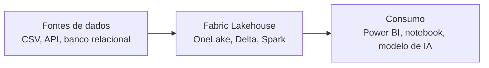
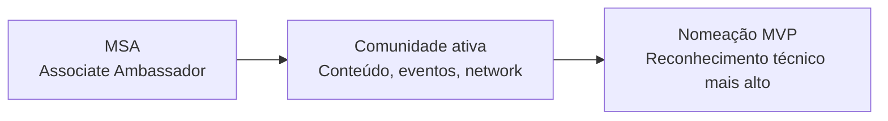

# MSA e Microsoft Fabric

### tecnologia e comunidade

Como aproveitar o programa Microsoft Student Ambassadors para acelerar uma carreira em dados.

Arthur Ferreira Reis · TIES Day #07 · 15/08/2026 · UniSales

<!--
Gancho de 1 frase, o que a plateia vai levar da palestra.
Pergunta de sondagem: "quem aqui já ouviu falar do MSA?" / "quem já mexeu com Azure ou Fabric?"
-->

---
layout: center
class: text-center
---

# Feito por essa comunidade

O TIES Day existe graças à comunidade TIES, ao apoio da dotcode e à casa cedida pela UniSales. Obrigado.

  
  

  

---
layout: image-right
image: /img/arthur.jpg
backgroundSize: contain
class: pl-10
---

# Arthur Ferreira Reis

### Data & AI Engineer

Trabalho com Microsoft Fabric, Databricks e Azure construindo plataformas de dados modernas: lakehouses, pipelines de alta performance e frameworks de qualidade de dados. 5+ anos de experiência com dados.

  13 certificações
  Microsoft Student Ambassador · Associate

<!--
Quem é você, cargo, MSA Associate, 13 certificações.
-->

---

# O que você vai levar daqui

01

O que é o MSA

02

Como entrar e evoluir

03

Fabric e Azure na prática

<!--
Os 3 blocos que vêm a seguir.
-->

---
layout: center
class: text-center
---

# Parte 1
## O que é o MSA

---
layout: image-right
image: /img/microsoft-logo.svg
backgroundSize: 60% auto
class: pl-10
---

# Um programa global da Microsoft

para estudantes do ensino superior, mantido diretamente pela empresa

- Não precisa ser de TI, é aberto a qualquer curso
- Gratuito, sem processo seletivo e sem entrevista
- Você aprende, gera conteúdo e Microsoft te dá ferramentas em troca

---

# Saiu do foco só em devs

### Programa redesenhado para toda a comunidade acadêmica

- Antes era quase só programação, agora cobre IA, dados, design, negócios
- Porta de entrada para o ecossistema Microsoft como um todo
- Caminho aberto até a nomeação MVP, o reconhecimento mais alto da comunidade

---
layout: center
class: text-center
---

# Parte 2
## Como entrar e se manter

---

# Requisitos

Sem seleção por currículo, sem entrevista.

  
18 anos ou mais

  
Matriculado em instituição de ensino credenciada

  
Ter uma conta Azure for Students

  
Não ser funcionário nem contratado da Microsoft

---
layout: two-cols
layoutClass: gap-16
---

# Como entrar

O cadastro é livre, mas virar Ambassador reconhecido pede um pouco mais.

1. mvp.microsoft.com/studentambassadors, "Get Started" e cadastro (gratuito, sem entrevista)
2. Ter 1 certificação Microsoft ou Applied Skills tirada ou renovada nos últimos 12 meses
3. Cumprir uma de duas trilhas: 250 visitantes no seu link de Contributor ID, ou 1.000 conclusões de módulo via Learn Plan

::right::

  

<!--
QR code na tela aponta direto pro cadastro.
-->

---

# Como evoluir para Senior

Depois de qualificado como Ambassador, dá pra subir de nível.

- Pelo menos 1 ano ativo no programa, sem previsão de se formar nos próximos 6 meses
- Ter cumprido os requisitos do programa e estar engajado na comunidade local
- Perfil completo, com biografia e LinkedIn mostrando a participação no MSA

Nomeação avaliada pelo time do programa, duas vezes por ano

---
layout: center
class: text-center
---

# Parte 3
## Benefícios

---

# O que o programa te dá

Um pacote de ferramentas que custaria caro fora do programa.

  
Microsoft 365 Copilot

  
Visual Studio Enterprise

  
LinkedIn Learning

  
Vouchers de certificação

  
Swag e kit de boas-vindas

---
layout: center
class: text-center
---

### O benefício que mais importa hoje

# US$150

### em créditos Azure, todo mês

Dinheiro real de nuvem, de graça, enquanto você for estudante ativo no programa

---

# O que US$150 realmente cobre

VM de teste (B2s)

Cerca de US$30/mês, dá pra deixar ligada o mês inteiro e ainda sobra crédito

Banco de dados (Azure SQL Basic)

Cerca de US$5/mês, tranquilo pra um projeto de estudo rodando o tempo todo

Microsoft Foundry (IA generativa)

Paga só pelo uso, cabe fácil dentro do crédito mensal

---

# Pra que serve na prática

Não é crédito simbólico. Dá pra sustentar um ambiente de estudo o mês inteiro.

- Montar um workspace de Fabric e explorar o OneLake
- Testar um pipeline de dados de ponta a ponta
- Subir uma POC pra portfólio
- Treinar um modelo simples de machine learning
- Explorar IA generativa no Microsoft Foundry, testando agentes e modelos

Sem gastar um centavo do próprio bolso

---

# Do dado bruto ao insight

Isso tudo cabe dentro do crédito mensal, sem infraestrutura própria

---
layout: center
class: text-center
---

# Parte 4
## Carreira em dados

---

# Portfólio real

### Cada POC feita com o crédito vira case de verdade

- Documenta e publica no GitHub, com README explicando as decisões
- Vira post no LinkedIn contando o problema e a solução
- Fica pronto pra mostrar em qualquer processo seletivo

---

# Certificações abrem portas

- DP-750 e DP-700, as duas certificações de Fabric
- AZ-900, DP-900, AI-900, os fundamentos de Azure
- Praticar de verdade com o crédito ajuda muito mais a passar na prova do que só decorar teoria

Diferencial direto em processo seletivo de estágio e primeiro emprego

---

# Comunidade e network

O programa te coloca em contato direto com quem já trilhou o caminho.

- Contato direto com MVPs e outros embaixadores, como os que estão aqui no TIES Day
- Contato com embaixadores de outras faculdades e outros estados
- Acesso direto ao ecossistema técnico da Microsoft

---

# Um caminho, não um fim

Oportunidades de palestra, reconhecimento técnico e network profissional que continuam depois da faculdade

---
layout: center
class: text-center
---

# Parte 5
## Na prática

---
layout: center
class: text-center
---

### Demo ao vivo

# Azure Portal

Vou trocar de tela agora e mostrar direto no navegador.

- Onde ver o crédito de estudante disponível
- Como criar um recurso do zero

<!--
Preparar antes do evento: ambiente logado, fallback pronto caso a internet falhe.
Se der tempo, abrir também o Fabric (Lakehouse/OneLake) fora do slide, direto no navegador.
Mensagem central: "dá pra fazer isso hoje, com o crédito do MSA, não é abstrato"
-->

---

# Recapitulando

O que é

Programa global e gratuito da Microsoft, aberto a qualquer curso

Como entrar

mvp.microsoft.com/studentambassadors, sem seleção

Como se manter

Compartilhar conteúdo e organizar/participar de eventos

O que ganha

US$150/mês em créditos Azure, certificações e comunidade

---
layout: center
class: text-center
---

# Obrigado

### Arthur Ferreira Reis

  

    
    
LinkedIn

  

  

    
    
YouTube

  

TIES Day #07 · UniSales

